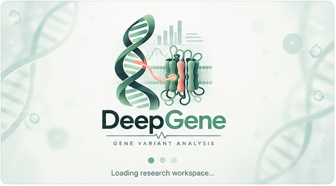

# DeepGene v1 and v2 Research Roadmap

<p align="center">
  
</p>

DeepGene is a local-first, research-oriented bioinformatics project for
evidence-aware analysis of SCN1A variants. It combines a reproducible data
pipeline, SQLite evidence storage, transparent analyses, research-only
functional-effect models, and a browser-based research assistant.

> **Safety boundary:** DeepGene is not a diagnostic system, pathogenicity
> classifier, disease-risk calculator, treatment recommender, or substitute for
> geneticist review. Its model outputs are exploratory research results.

## DeepGene v2 research direction

DeepGene v1 is the reproducible foundation. DeepGene v2 is planned as a formal
research study titled **Evidence-Aware and Uncertainty-Calibrated Machine
Learning for SCN1A Variant Prioritization**.

The central research question is not simply whether a model can assign a class
to a variant. It is whether a research framework can integrate heterogeneous
evidence, estimate how reliable its output is, identify missing or conflicting
evidence, and prioritize variants for further expert investigation.

The v2 workflow is planned as:

```text
SCN1A variant
      ↓
Evidence extraction and normalization
      ↓
Evidence integration
      ↓
Pathogenicity probability
      ↓
Uncertainty estimation and probability calibration
      ↓
Explainability and evidence completeness
      ↓
Variant prioritization
      ↓
Expert review support
```

V2 will remain research decision support. A high model probability is not a
diagnosis, and a VUS will be described as a candidate for further investigation,
not declared pathogenic or benign.

### V2 research objectives

1. Build a unique-variant SCN1A representation containing variant, population,
   clinical/phenotypic, computational, and functional evidence.
2. Compare transparent baseline models with an evidence-aware model.
3. Estimate predictive uncertainty and calibrate probability outputs.
4. Measure evidence completeness and conflict separately from model confidence.
5. Explain supporting, missing, conflicting, and influential evidence.
6. Test whether evidence-aware ranking improves the selection of variants for
   expert investigation.

### V2 dataset design

The current SCN1A audit contains 5,381 unique variants and 10,696 ClinVar
records. Multiple ClinVar submissions for the same underlying variant must not
be treated as independent samples. Dataset versions will record the ClinVar
release, genome assembly, transcript, filters, preprocessing version, and
feature version.

The planned research cohorts are:

| Cohort | Purpose | Treatment |
|---|---|---|
| Full SCN1A set | Exploration and descriptive analysis | Preserve all usable variants |
| Supervised set | Initial binary model development | Pathogenic/Likely Pathogenic vs Benign/Likely Benign |
| VUS set | Separate prioritization experiment | Keep VUS out of binary labels |
| Expert benchmark | Independent evaluation | Use reviewed ClinGen expert-panel variants where available |

Conflicting and unresolved classifications will not be forced into binary
labels. The model must not receive the final target classification as an input
when that same classification is being evaluated. Splits will be performed by
unique variant, not by individual ClinVar submission.

### Planned V2 evidence blocks

- **Variant:** HGVS, consequence, SNV/indel class, amino-acid change, position,
  exon, and protein region.
- **Population:** allele frequency, maximum frequency, population-specific
  frequency, and rarity indicators.
- **Clinical and phenotype:** conditions, phenotype availability, review status,
  submission history, and conflict indicators.
- **Computational:** conservation, existing prediction scores, protein-level
  predictions, and structural features where available.
- **Functional:** assay type, experimental effect, evidence strength, and
  explicitly preserved LOF/GOF information.

The feature audit will distinguish unavailable evidence from assessed absence,
and computational annotations from experimentally supported functional effects.

### Planned models and outputs

V2 will first compare Logistic Regression, Random Forest, and Gradient
Boosting/XGBoost baselines. The proposed evidence-aware framework will then be
evaluated against them. Candidate uncertainty methods include ensemble
disagreement, predictive entropy, and conformal prediction where appropriate;
the final method will be selected by experiment rather than assumed in
advance.

For each variant, the planned research output is:

```text
Pathogenicity probability
Uncertainty estimate
Probability calibration information
Evidence completeness
Conflict indicators
Supporting and missing evidence
Model contribution or evidence-group explanation
Research prioritization score
```

Evidence completeness must not be confused with confidence. A confident output
based on incomplete or conflicting evidence should remain visibly cautious.

### Validation and experiments

The V2 evaluation plan includes:

- variant-disjoint holdout validation;
- five-fold cross-validation where appropriate;
- an independent ClinGen expert-panel benchmark;
- temporal validation if reliable historical data can be reconstructed;
- an ablation study from baseline through variant, population, computational,
  clinical, functional, evidence-fusion, uncertainty, and calibration stages;
- a separate VUS prioritization experiment.

Evaluation will cover discrimination (AUROC, AUPRC, F1, MCC, sensitivity and
specificity), calibration (Brier score, ECE and reliability diagrams), ranking
(Precision@K, Recall@K, NDCG@K and MRR), and uncertainty reliability. Numerical
results are intentionally not predetermined.

### V1 to V2 implementation sequence

1. Freeze the current V1 pipeline as a reproducible baseline.
2. Audit the V1 schema, preprocessing, features, labels, model, and frontend.
3. Create `SCN1A_V2_master.csv` and a formal data dictionary.
4. Complete a feature-level leakage audit and define the research protocol.
5. Train and evaluate baseline models using unique-variant splits.
6. Implement evidence integration, calibration, uncertainty, explainability,
   and prioritization as separately testable components.
7. Run VUS, expert-benchmark, temporal, and ablation experiments when their
   data requirements are satisfied.
8. Generate reproducible figures and tables and prepare the manuscript.

The planned software layout follows this separation of concerns:

```text
preprocessing/  features/  models/  calibration/
explainability/ prioritization/ evaluation/ experiments/
paper/          frontend/
```

This roadmap describes planned work, not completed validation. DeepGene v2
will not be presented as clinically deployable unless future independent
validation genuinely supports that claim.

## 1. What DeepGene v1 does

```text
Public and supplied research data
              ↓
Validated tables and SQLite evidence store
              ↓
Transparent analysis and leakage-aware features
              ↓
Research-only models and conversational exploration
```

DeepGene keeps four concepts separate:

- **Evidence:** observations and submitted classifications, such as ClinVar.
- **Annotations:** supporting scores, such as AlphaMissense.
- **Labels:** explicit targets, such as experimentally reported LOF or GOF.
- **Predictions:** outputs produced by a trained research model.

This separation prevents existing clinical classifications or annotation scores
from silently becoming independent training labels.

## 2. Repository structure

```text
Project_DeepGene_2.0/
├── app/                  Local HTTP server and browser frontend
├── data/raw/             Source-preserved downloads and datasets
├── data/processed/       Normalized and feature-ready tables
├── data/database/        SQLite database and database scripts
├── data/data_analysis/   Evidence, phenotype, and QC analyses
├── data/ml/              Reproducible ML preparation/training scripts
├── data/model/           Research model artifacts and metadata
├── data/analysis_results/  JSON/TXT evaluation reports
├── data/uploads/         Files received through the Data Lab
├── data/memory/          Local chat memory; ignored by Git
└── README.md
```

## 3. Data inventory

### ClinVar evidence

```text
data/raw/SCN1A_clinvar.tsv
data/raw/variant_summary.txt.gz
data/database/scn1a.db
data/processed/SCN1A_clinvar_clean.csv
```

Current database snapshot:

| Entity | Count |
|---|---:|
| Genes | 1 |
| Unique SCN1A variants | 5,381 |
| Variant representations | 10,696 |
| ClinVar evidence records | 10,696 |

The SQLite model separates biological identity from genomic representation and
submitted evidence:

```text
genes
  └── variants
        ├── variant_representations
        └── clinvar_records
```

The ClinVar layer preserves clinical-significance strings, review status,
submitter context, phenotype descriptions, HGVS names, assemblies, genomic
coordinates, and dbSNP identifiers. These are source evidence, not automatic
independent ground truth.

### SCION functional data

```text
data/raw/scion_clean_tbl.csv
data/raw/generation2_source_manifest.json
data/processed/deepgene_gen2_scion_harmonized_v1.csv
data/processed/deepgene_gen2_ml_ready_v1.csv
data/model/deepgene_generation2_gbm.pkl
```

The SCION source contains 375 functional records across nine sodium-channel
genes. Forty exact overlaps with the earlier DeepGene functional set were
excluded, leaving 335 rows in the current Generation-2 matrix. LOF and GOF are
the primary labels; mixed or unclear effects are excluded rather than forced
into a binary class.

Source: [SCION](https://github.com/christianbosselmann/SCION).

### SCN1A experimental supplementary data

```text
data/raw/SCN1A_Brunklaus_2020_supplementary.xlsx
data/processed/deepgene_scn1a_brunklaus_2020_functional.csv
data/model/deepgene_scn1a_supplement_candidate.pkl
data/analysis_results/49_scn1a_supplement_model.json
```

The public workbook contains 59 SCN1A records. The reproducible preparation
pipeline retains 40 explicit binary functional labels:

```text
LOF: 36
GOF:  4
```

Mixed, unclear, insufficient-data, no-effect, and missing-label rows are
excluded. Source: [UCL Discovery](https://discovery.ucl.ac.uk/id/eprint/10091164/).

### AlphaMissense annotations

```text
data/uploads/AlphaMissense_gene_hg38.tsv.gz
data/processed/alphamissense_gene_hg38.csv
```

The Data Lab accepts gzip-compressed tables with:

```text
transcript_id,mean_am_pathogenicity
```

The current upload contains 19,233 transcript scores. AlphaMissense is stored
as annotation evidence. It does not trigger LOF/GOF retraining because these
scores are not experimentally verified LOF/GOF labels.

## 4. How the project was built

### Evidence pipeline

```text
ClinVar source data
       ↓
SCN1A extraction and cleaning
       ↓
SQLite database
       ↓
Statistics, significance, quality, phenotype, and representation audits
       ↓
Evidence profiles and transparent baseline
```

The database keeps multiple genomic representations attached to one biological
variant. Downstream analysis therefore does not treat every representation as
an independent biological observation.

The main analysis stages are in `data/data_analysis/`, including variant
statistics, clinical significance, evidence quality, phenotype analysis,
variant representation, feature engineering, transparent prioritization, and
benchmark feasibility checks.

### Feature engineering

The evidence features cover four groups:

1. Clinical significance and classification counts.
2. Reliability/context, including submitters, review status, expert-panel
   review, and conflicting assertions.
3. Phenotype availability and preserved phenotype text.
4. Variant identity and QC, including HGVS, assemblies, coordinates, and
   dbSNP representation.

The project distinguishes unavailable evidence from assessed absence. Missing
data is not silently converted into a negative biological finding.

### Leakage control

An existing ClinVar classification must not be used as a feature when that same
classification is the target being evaluated. Otherwise the model can reproduce
the answer it was given without demonstrating independent predictive ability.

DeepGene therefore separates:

```text
Evidence used for prioritization ≠ Labels used for evaluation/training
```

Independent clinical benchmark labels are not yet available for the Dravet
branch, so that branch remains blocked rather than using fabricated labels.

## 5. How the models work

### Generation-2 cross-channel candidate

The Generation-2 candidate predicts functional LOF versus GOF using engineered
sequence-change features and gene indicators with a Gradient Boosting
classifier. Its primary evaluation is leave-one-gene-out validation.

Current benchmark result:

```text
Balanced accuracy: approximately 0.6368 +/- 0.1465
```

This is a research benchmark, not independent clinical validation.

### SCN1A supplementary candidate

Rebuild it with:

```powershell
python data/ml/49_prepare_scn1a_supplement.py
python data/ml/49_train_scn1a_supplement.py
```

The pipeline reads explicit Loss/Gain rows, converts amino-acid names to
one-letter codes, constructs physicochemical features, combines the rows with
the existing harmonized functional set, deduplicates variants, trains a
`GradientBoostingClassifier`, and saves the model plus a JSON report.

Current evaluation:

| Metric | Result |
|---|---:|
| Combined deduplicated rows | 377 |
| Internal holdout rows | 95 |
| Balanced accuracy | 0.718 |
| ROC-AUC | 0.750 |

The artifact is marked `research_candidate_not_clinical`. The holdout is an
internal random split, not an independent external test set.

### Dravet branch

The Dravet model is intentionally not trained until a separate reviewed
variant-level clinical label file is supplied. LOF/GOF labels cannot be
substituted for Dravet labels because SCN1A functional effects span multiple
clinical phenotypes.

Required future label fields include:

```text
variant_key,dravet_label,label_source,source_accession,cohort_id,reviewer_status
```

Unknown and unresolved cases must remain unknown rather than becoming negative
labels.

## 6. Local dashboard

Start from the project root:

```powershell
python app/server.py
```

Open [http://127.0.0.1:8765/](http://127.0.0.1:8765/).

The dashboard has two pages:

- **Research Chat:** local evidence questions, optional natural-language AI,
  in-session conversation, local memory, and workspace metrics.
- **Data Lab:** ClinVar import, functional LOF/GOF retraining, and AlphaMissense
  `.tsv.gz` ingestion.

### Optional AI provider

The current implementation uses OpenRouter rather than a direct OpenAI API
client:

```powershell
$env:OPENROUTER_API_KEY="your-real-key"
python app/server.py
```

Without a key, the local evidence assistant remains available. If the external
provider fails, the server falls back to local answers.

### Conversation memory

Chat turns are saved locally in:

```text
data/memory/conversations.jsonl
```

This is retrieval-style memory. It gives later requests previous local context,
but it does not update the weights of the external AI model and does not turn
ordinary conversation into ML labels. The memory file is ignored by Git because
it may contain sensitive research notes.

## 7. Data Lab upload behaviour

| Input | Result |
|---|---|
| ClinVar CSV/TSV | Validate and import into SQLite |
| Functional CSV/TSV | Validate and build a research candidate model |
| AlphaMissense `.tsv.gz` | Decompress, validate, and store as annotations |

The endpoint is `POST /api/upload`. Accepted uploads are recorded in
`data/uploads/upload_audit.jsonl`. No upload is automatically promoted to a
clinical model.

## 8. Reproducible commands

Validate the key Python and JavaScript files:

```powershell
python -m py_compile app/server.py data/ml/49_prepare_scn1a_supplement.py data/ml/49_train_scn1a_supplement.py
node --check app/static/app.js
```

Run the dashboard health check:

```powershell
Invoke-RestMethod http://127.0.0.1:8765/api/health
```

Inspect the current workspace:

```powershell
Invoke-RestMethod http://127.0.0.1:8765/api/summary | ConvertTo-Json -Depth 5
```

## 9. v1 status

```text
ClinVar extraction and SQLite database                 COMPLETE
Evidence and QC analyses                               COMPLETE
Transparent evidence baseline                          COMPLETE
SCION Generation-2 functional candidate                COMPLETE
SCN1A supplementary functional candidate               COMPLETE
AlphaMissense annotation ingestion                     COMPLETE
Local research dashboard                               COMPLETE
Conversation memory                                    COMPLETE
Independent clinical benchmark labels                  PENDING
Dravet clinical-outcome model                          BLOCKED
External clinical validation                           PENDING
```

## 10. Limitations and responsible use

1. ClinVar contains submitted assertions with heterogeneous evidence, review
   status, and possible conflicts.
2. Functional effects are assay- and context-dependent; LOF, GOF, mixed, and
   normal effects are not interchangeable clinical outcomes.
3. Current functional models use small research datasets and limited holdout
   designs.
4. AlphaMissense scores are annotations, not ground-truth clinical labels.
5. Conversation text is not automatically trustworthy training data.
6. No current DeepGene artifact is a diagnostic, pathogenicity, risk,
   treatment, or clinical decision model.

## 11. Development principles

- Preserve raw source files and provenance.
- Keep evidence, annotations, labels, and predictions separate.
- Represent missing and conflicting evidence explicitly.
- Exclude mixed or uncertain labels rather than forcing classes.
- Test for target leakage before training.
- Prefer interpretable baselines before complex models.
- Version datasets, scripts, artifacts, and evaluation reports together.
- Require expert review before clinical interpretation.

Third-party datasets retain their own source licenses and usage conditions.
Review the original provider terms before redistribution or clinical use.

**DeepGene v1 is a reproducible research foundation, not a completed clinical
product.**
